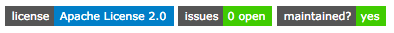

# Dockzoo

The docker built images for Zookeeper tests &amp; builds.

Create the image the standard way:

    docker build .

The image is also available on Docker Hub @ [Dockzoo](https://hub.docker.com/r/adron/dockzoo/).

*Author:* **Adron(-Orange)** @ **[Github](https://www.github.com/adron-orange)** or **[Twitter](https://twitter.com/adron_orange)**.
